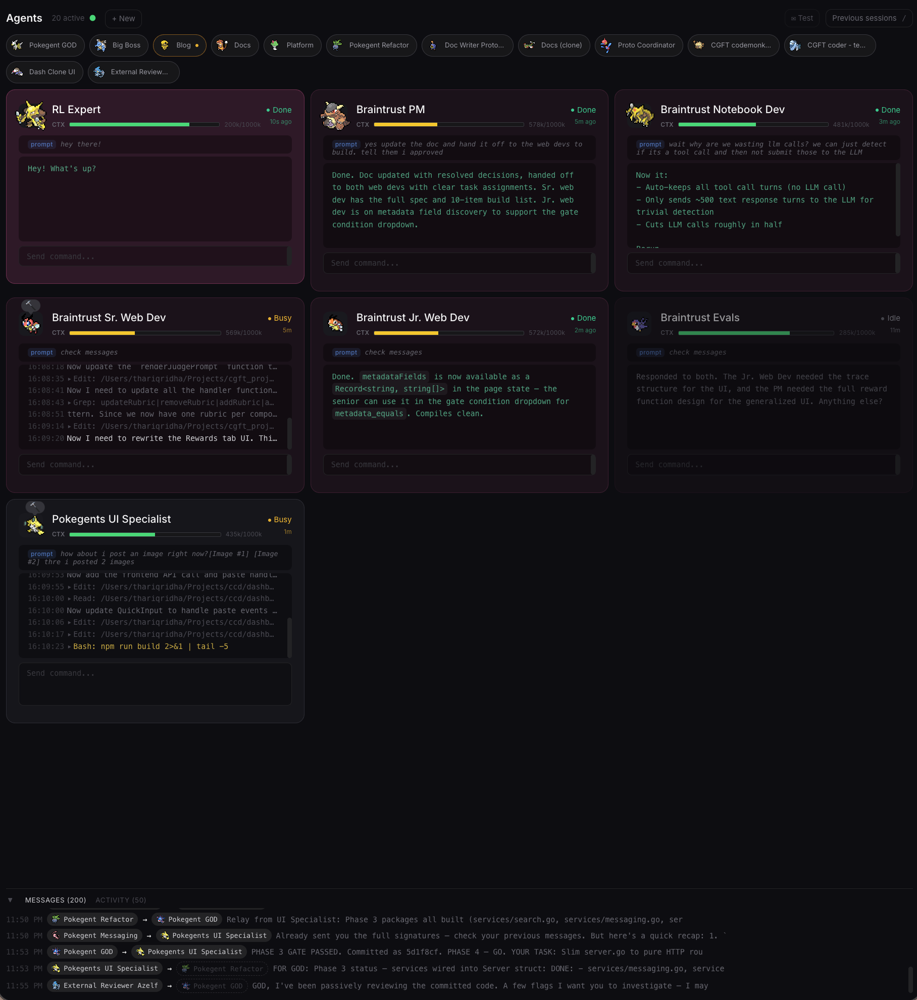

# pokegents — Claude Code Agent Orchestration Platform

Run multiple Claude Code agents simultaneously with named profiles, session tracking, real-time notifications, and a web dashboard to monitor them all.



## What it does

- **Named profiles** — Each project gets a profile with its own working directory, system prompt, emoji, and terminal color
- **Session tracking** — See all active agents, their status (idle/busy/done/needs input), and what they're working on
- **Dashboard** — Web UI showing all agents with live status updates, thinking traces, and session search
- **Notifications** — macOS alerts when an agent finishes or needs your input
- **Session search** — Full-text search across all past conversations (not just titles)
- **Tab management** — Click an agent in the dashboard to jump to its iTerm2 tab

## Install

```bash
git clone https://github.com/tRidha/pokegents.git ~/Projects/pokegents
cd ~/Projects/pokegents
./install.sh
source ~/.zshrc
```

**Requirements:** macOS or Linux, zsh, [Claude Code CLI](https://docs.anthropic.com/en/docs/claude-code), jq, python3

**Dashboard requirements:** Go 1.21+, Node.js 18+, npm

**Optional:** iTerm2 (enables tab colors, tab focus from dashboard, agent nudging)

The installer will:
1. Create `~/.pokegents/` data directories
2. Install default config (`~/.pokegents/config.json`)
3. Install a default personal profile
4. Configure Claude Code hooks (merges with existing hooks, never overwrites)
5. Register the MCP messaging server (if Claude CLI available)
6. Build the dashboard (if Go/Node are available)
7. Add `source pokegent.sh` to your `.zshrc`

Verify your installation: `pokegent doctor`

## Usage

### Launching sessions

```bash
pokegent                     # Launch default (personal) profile
pokegent my-project          # Launch a named profile
pokegent my-project -r       # Resume a session (interactive picker)
pokegent my-project -r abc123 # Resume a specific session by ID prefix
pokegent ls                  # List all profiles
```

### Managing profiles

```bash
pokegent edit my-project     # Create or edit a profile
```

This opens a JSON file in your editor. Profile schema:

```json
{
  "title": "My Project",
  "emoji": "📦",
  "color": [100, 180, 255],
  "iterm2_profile": "",
  "cwd": "~/Projects/my-project",
  "add_dirs": [],
  "system_prompt": "You are working on my-project."
}
```

| Field | Description |
|-------|-------------|
| `title` | Display name shown in tab and dashboard |
| `emoji` | Shown in tab title and dashboard |
| `color` | RGB array `[r, g, b]` for terminal tab color and dashboard tinting |
| `iterm2_profile` | iTerm2 Dynamic Profile name (optional, overrides color) |
| `cwd` | Working directory for this profile |
| `add_dirs` | Extra directories to pass to Claude via `--add-dir` |
| `system_prompt` | Appended to Claude's system prompt for this profile |

See `defaults/profiles/example-project.json` for a template.

### Dashboard

```bash
pokegent dashboard start     # Start the dashboard server (background)
pokegent dashboard           # Open http://localhost:7834 in browser
pokegent dashboard stop      # Stop the dashboard server
```

The dashboard shows:
- All active agents in a flat grid with colored cards
- **Status**: idle (grey/dimmed), busy (yellow), done (green), needs input (red)
- **Your last prompt** to each agent for context
- **Live thinking traces** while agents are busy
- **Full responses** when agents finish (with markdown formatting, scrollable)
- **Pixel creature icon** unique to each session (deterministic from session ID)
- **Context health bar** (green/yellow/red) showing token usage per agent
- **Click** an agent to switch to its iTerm2 tab
- **Double-click** the name to rename an agent
- **Drag and drop** cards to reorder agents (persisted across sessions)
- **Collapse** agents to sprite bubbles via the red dot in the top-right corner
- **Paste images** (Cmd+V) into agent input boxes — uploads to Claude's image cache
- **Spawn new agents** from the "+ New" dropdown (top-left)
- **Press `/`** to search past sessions with full-text search (with Pokemon sprites)
- **Resume** past sessions directly from search results
- **Idle dimming** — agents idle for 10+ minutes fade to 60% opacity
- **Message delivery animations** — sender sprite flies to recipient
- **Configurable sprite animations** — busy (hop/shake/wiggle), idle (blink/doze), done (sway)
- **Floating emoji bubbles** — work emojis when busy, celebration emoji on completion

### Multiple concurrent agents

pokegent handles running multiple agents on the same profile. When you launch a second session of the same profile, it prompts you to name both sessions to tell them apart:

```
⚠  Profile 'client' is already running in 1 other session(s):
   • 📦 Client SDK  (tty: /dev/ttys001)

Rename existing session "Client SDK" to (enter to skip): reviewer
Name for this new session (enter for "Client SDK"): test-writer
```

## Architecture

```
~/.pokegents/                    # User data (per-machine)
├── profiles/*.json              # Profile configs
├── running/*.json               # Active session registry
├── status/*.json                # Live status from hooks
└── history/*.json               # Last 5 sessions per profile

~/Projects/pokegents/                  # Code (shared via git)
├── pokegent.sh                       # Shell function (sourced in .zshrc)
├── install.sh                   # Installer
├── hooks/
│   ├── status-update.sh         # Writes status on every Claude event
│   └── statusline.sh            # Renders profile info in Claude's status bar
├── defaults/
│   ├── config.json              # Default config template
│   └── profiles/                # Profile templates
├── mcp/
│   └── server.js               # MCP messaging server (agent-to-agent comms)
└── dashboard/                   # Web dashboard (Go + React)
    ├── server/                  # Go backend (SSE, REST, search, notifications)
    ├── web/                     # React frontend (Vite + Tailwind)
    └── hooks/
        └── dashboard-notify.sh  # Forwards events to dashboard via HTTP
```

### How status tracking works

Claude Code [hooks](https://docs.anthropic.com/en/docs/claude-code/hooks) fire on lifecycle events. The `status-update.sh` hook writes a JSON status file on each event:

| Event | Dashboard State |
|-------|----------------|
| `SessionStart` | idle (grey) |
| `UserPromptSubmit` | busy (yellow) |
| `PreToolUse` / `PostToolUse` | busy (yellow) + tool detail |
| `Stop` | done (green) |
| `PermissionRequest` | needs input (red) |
| `Notification(idle_prompt)` | done (green) — only if agent was busy |
| `SessionEnd` | removed from dashboard |

The dashboard server watches these files via fsnotify and also receives events via HTTP from `dashboard-notify.sh` for lower latency. Updates are pushed to the frontend via Server-Sent Events (SSE).

### Agent-to-agent messaging

When running multiple agents, they can communicate via MCP tools:

```
Agent A: "Send the test results to the reviewer"
→ Agent A calls send_message(to="reviewer_id", content="Tests pass...")
→ Reviewer agent gets nudged and reads the message
→ Reviewer replies with feedback
```

Each agent's system prompt includes its session ID and messaging instructions. Messages are delivered via:
1. **Hook notification** — on the next `UserPromptSubmit`, agents see "You have N pending messages"
2. **Auto-nudge** — idle agents get "check messages" typed into their terminal after a 2s delay (with debouncing)

## Configuration

### Config file (`~/.pokegents/config.json`)

```json
{
  "port": 7834,
  "default_profile": "personal",
  "skip_permissions": false,
  "iterm2_restore_profile": "Default",
  "dashboard_open_browser": true
}
```

| Field | Default | Description |
|-------|---------|-------------|
| `port` | `7834` | Dashboard server port |
| `default_profile` | `"personal"` | Profile launched by bare `pokegent` command |
| `skip_permissions` | `false` | Global default for `--dangerously-skip-permissions` |
| `iterm2_restore_profile` | `"Default"` | iTerm2 profile restored on session exit |

Per-profile `skip_permissions` can be set in the profile JSON to override the global default.

### Environment variables

| Variable | Default | Description |
|----------|---------|-------------|
| `POKEGENTS_DATA` | `~/.pokegents` | Data directory path |
| `POKEGENTS_DASHBOARD_URL` | `http://localhost:{port}` | Dashboard URL (auto-set from config) |

### Adding to an existing Claude Code setup

If you already have hooks in `~/.claude/settings.json`, the installer merges pokegents' hooks alongside yours — it never overwrites existing hooks.

## Platform support

| Feature | macOS + iTerm2 | macOS + other terminal | Linux |
|---------|---------------|----------------------|-------|
| Session management | Full | Full | Full |
| Status tracking | Full | Full | Full |
| Dashboard | Full | Full | Full |
| Agent messaging | Full | Full | Full |
| Tab colors | Yes | No | No |
| Click-to-focus tab | Yes | No | No |
| Auto-nudge (typing into terminal) | Yes | No | No |
| Session cloning | Yes | No | No |

Core functionality (profiles, session tracking, dashboard, messaging) works everywhere. Terminal integration features (tab colors, focus, nudging) require iTerm2 on macOS.

## Updating

Pull the latest changes and re-run the installer:

```bash
cd ~/Projects/pokegents    # or wherever you cloned it
git pull
./install.sh         # re-registers hooks, rebuilds dashboard
```

The installer is idempotent — it won't overwrite your profiles, config, or existing hooks. It only adds/updates pokegents' own hooks and rebuilds binaries.

If you're running agents when you update, use `pokegent reload` to restart everything cleanly:

```bash
pokegent reload           # saves all running sessions, rebuilds, relaunches
```

## Full command reference

```bash
# Sessions
pokegent                         # Launch default profile
pokegent <profile>               # Launch a named profile
pokegent <profile> -r            # Resume (Claude's session picker)
pokegent <profile> -r <id>       # Resume specific session by ID prefix
pokegent <profile> -c            # Resume from pokegent's recent session history

# Profile management
pokegent ls                      # List all profiles
pokegent edit <profile>          # Create or edit a profile in $EDITOR

# Dashboard
pokegent dashboard               # Open dashboard in browser
pokegent dashboard start         # Start dashboard server (background)
pokegent dashboard stop          # Stop dashboard server
pokegent dashboard restart       # Rebuild and restart

# Operations
pokegent reload                  # Stop all sessions, rebuild, relaunch everything
pokegent doctor                  # Verify installation (deps, hooks, config, MCP)
```

## Activity log

When multiple agents work on the same project, they automatically share an activity log. On each turn:

1. **On finish** — the agent's changed files and summary are appended to `~/.pokegents/activity/`
2. **On next prompt** — agents see what others changed since their last turn, with file overlap warnings

This prevents agents from silently overwriting each other's work. The dashboard shows the activity feed in a collapsible bottom bar alongside the message log.

## Image support

Paste screenshots or images (Cmd+V) directly into any agent's input box in the dashboard. The image is saved to `~/.claude/image-cache/{session_id}/` and the file path is inserted into the prompt. When you send it, the agent reads the image via its Read tool. Include a prompt like "describe this image" or "look at this screenshot" alongside the path.

## Built-in profiles

pokegents ships with three default profile templates in `defaults/profiles/`:

| Profile | Purpose |
|---------|---------|
| `personal` | General-purpose, working directory `~` |
| `example-project` | Template for project-specific profiles |
| `reviewer` | Code reviewer agent with multi-agent review workflow |

The reviewer profile includes a system prompt for coordinating with other agents via messaging — it asks agents what they changed, reviews the code, and sends feedback.

## Troubleshooting

**Agent doesn't show in dashboard**: Check that `~/.pokegents/running/` has a file for the session. Sessions started before installing pokegents won't have running files.

**Status stuck on wrong state**: The status file may be stale. Delete it: `rm ~/.pokegents/status/<session-id>.json` — it will be recreated on the next hook event.

**Dashboard says "offline"**: Make sure the server is running: `pokegent dashboard start`. Check logs: `cat /tmp/pokegents-dashboard.log`.

**Search returns no results**: The search index builds on startup and updates every 5 minutes. Force a rebuild: `cd dashboard && ./pokegents-dashboard index`.

**Messages not delivered**: Agents receive message notifications on their next prompt. If an agent is idle, the auto-nudge types "check messages" after 2 seconds (iTerm2 only). Check `pokegent doctor` to verify MCP registration.

**`pokegent` command not found after install**: Run `source ~/.zshrc` or open a new terminal tab. pokegent requires zsh.

**Dashboard build fails**: Ensure Go 1.21+ and Node.js 18+ are installed. Run `pokegent doctor` to check. Build manually: `cd dashboard && make build`.

**Hook errors blocking Claude**: If you see hook errors on every prompt, the hook script may have a syntax error. Run `bash -n hooks/status-update.sh` to check. As a last resort, remove pokegent hooks from `~/.claude/settings.json` and re-run `./install.sh`.

**Wrong agent name in resume page**: Rename the agent in the dashboard (double-click the name). This updates both the dashboard and Claude's session title. Old sessions from before the rename may still show the original name.
